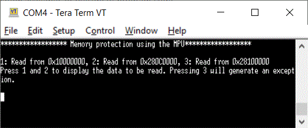
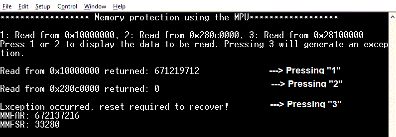

# PROT_CPU_MPU_Configuration
**This code example shows how to configure the Memory Protection Unit (MPU), which is part of the CPU, and describes its operation and initial settings.**  

## Device
The device used in this code example (CE) is:
- [TRAVEO™ T2G CYT4BF Series](https://www.infineon.com/cms/en/product/microcontroller/32-bit-traveo-t2g-arm-cortex-microcontroller/32-bit-traveo-t2g-arm-cortex-for-body/traveo-t2g-cyt4bf-series/)

## Board
The board used for testing is:
- TRAVEO™ T2G evaluation kit ([KIT_T2G-B-H_EVK](https://www.infineon.com/cms/en/product/evaluation-boards/kit_t2g-b-h_evk/), [KIT_T2G-B-H_LITE](https://www.infineon.com/cms/en/product/evaluation-boards/kit_t2g-b-h_lite/))

## Scope of work

In this example, the memory is split in different regions and protected. When a protected region is tried to access, an exception is raised.

## Introduction  

**Memory Protection Unit**  
Protection units in the TRAVEO™ T2G series device enforce security based on different operations. A protection unit allows or restricts bus transfers on the bus infrastructure. The rules are enforced based on specific properties of a transfer.

- An address range that is accessed by the transfer
	- Subregion: An address range is partitioned into eight equally-sized subregions and subregion can individual disables
- Access attributes such as:
	- Read/write attribute
	- Execute attribute to distinguish a code access from a data access
	- User/privilege attribute to distinguish access; for example, OS/kernel access from a task/thread access
	- Secure/non-secure attribute to distinguish a secure access from a non-secure access; the Arm Cortex-M CPUs do not 
natively support this attribute
	- A protection context attribute to distinguish accesses from different protection contexts; for Peripheral-DMA (P-DMA) and Memory-DMA (M-DMA), this attribute is extended with a channel identifier, to distinguish accesses from different channels
- Memory protection
- Provided by memory protection units (MPUs) and shared memory protection units (SMPUs)
	- MPUs distinguish user and privileged accesses from a single bus master
	- SMPUs distinguish between different protection contexts and between secure and non-secure accesses
- Peripheral protection
	- Provided by peripheral protection units (PPUs)
	- The PPUs distinguish between different protection contexts; they also distinguish secure from non-secure accesses 
and user mode accesses from privileged mode accesses
- Protection pair structure
- Software Protection Unit (SWPU): SWPUs define flash write (or erase) permissions, and eFuse read and write 
permissions. An SWPU comprises of the following:
	- Flash Write Protection Unit (FWPU)
	- eFuse Read Protection Unit (ERPU)
	- eFuse Write Protection Unit (EWPU)

More details can be found in [Technical Reference Manual (TRM)](https://www.infineon.com/dgdl/?fileId=5546d4627600a6bc017600bfae720007), [Registers TRM](https://www.infineon.com/dgdl/?fileId=5546d4627600a6bc017600be2aef0004) and [Data Sheet](https://www.infineon.com/dgdl/?fileId=5546d46275b79adb0175dc8387f93228).

## Hardware setup

This CE has been developed for:
- TRAVEO™ T2G evaluation kit ([KIT_T2G-B-H_EVK](https://www.infineon.com/cms/en/product/evaluation-boards/kit_t2g-b-h_evk/)) 
 
No changes are required from the board's default settings.

- TRAVEO™ T2G Body High Lite evaluation kit ([KIT_T2G-B-H_LITE](https://www.infineon.com/cms/en/product/evaluation-boards/kit_t2g-b-h_lite/)) 
 
No changes are required from the board's default settings.

## Implementation

 In this example, the MPU is configured to split the address range into 6 regions with different protection properties:
 
- Region 0
Base address: 0x00000000, Size: 4GB, Privileged: No access, User: No access, Execution is permitted

- Region 1
Base address: 0x10000000, Size: 8 MB, Privileged: Read only, User: Read only, Execution is permitted

- Region 2
Base address: 0x14000000, Size: 256 KB, Privileged: Read only, User: No access, Execution is not permitted

- Region 3
Base address: 0x28000000, Size: 1 MB, Privileged: Read/write, User: Read/write, Execution is permitted

- Region 4
Base address: 0x40000000, Size: 64 MB, Privileged: Read/write, User: Read/write, Execution is not permitted

- Region 5
Base address: 0xE0000000, Size: 512 MB, Privileged: Read/write, User: Read/write, Execution is not permitted

During runtime, the UART protocol is used to start a read of address 0x10000000, 0x280C0000, which both lay in regions, that allow read access and address 0x28100000, which lays in a restricted address range. A read in that restricted address range causes an exception, which can only be recovered by a hardware reset.

**STDOUT setting**

Initialization of the GPIO for UART is done in the <a href="https://infineon.github.io/retarget-io/html/group__group__board__libs.html#ga21265301bf6e9239845227c2aead9293"><i>cy_retarget_io_init()</i></a> function.
- Initialize the pin specified by CYBSP_DEBUG_UART_TX as UART TX, the pin specified by CYBSP_DEBUG_UART_RX as UART RX (these pins are connected to KitProg3 COM port)
- The serial port parameters become to 8N1 and 115200 baud

**MPU setting**

- To setup the MPU, <a href="https://infineon.github.io/mtb-pdl-cat1/pdl_api_reference_manual/html/group__group__prot__functions__mpu.html#ga8b368e9846d5a3b8cd284131562376b1"><i>Cy_Prot_ConfigMpuStruct()</i></a> is called with using structure <a href="https://infineon.github.io/mtb-pdl-cat1/pdl_api_reference_manual/html/structcy__stc__mpu__cfg__t.html"><i>cy_stc_mpu_cfg_t</i></a> as argument

- The MPU is enabled by  <a href="https://infineon.github.io/mtb-pdl-cat1/pdl_api_reference_manual/html/group__group__prot__functions__mpu.html#gaf86849b6ef266090238dc4f5d59161f2"><i>Cy_Prot_EnableMpuStruct()</i></a>.

**Fault handling**

The fault handler <a href="https://infineon.github.io/mtb-pdl-cat1/pdl_api_reference_manual/html/group__group__syslib__functions.html#ga0852597c5a10b76413a7063711043fef"><i>Cy_SysLib_ProcessingFault()</i></a> is overwritten to display MMFAR and MMFSR on read exception.

## Run and Test
For this example, a terminal emulator is required for displaying outputs. Install a terminal emulator if you do not have one. Instructions in this document use [Tera Term](https://ttssh2.osdn.jp/index.html.en).

After code compilation, perform the following steps to flashing the device:
1. Connect the board to your PC using the provided USB cable through the KitProg3 USB connector.
2. Open a terminal program and select the KitProg3 COM port. Set the serial port parameters to 8N1 and 115200 baud.
3. Program the board using one of the following:
    - Select the code example project in the Project Explorer.
    - In the **Quick Panel**, scroll down, and click **[Project Name] Program (KitProg3_MiniProg4)**.
4. After programming, the code example starts automatically. Confirm that the messages are displayed on the UART terminal.

    - *Terminal output on program startup* 

5. Pressing 1 or 2 will return the data of the specified regions. By pressing 3, a read access to a protected region is created and causes the MPU to raise an exception.

    - *Terminal output on memory read* 

6. You can debug the example to step through the code. In the IDE, use the **[Project Name] Debug (KitProg3_MiniProg4)** configuration in the **Quick Panel**. For details, see the "Program and debug" section in the [Eclipse IDE for ModusToolbox™ software user guide](https://www.infineon.com/dgdl/?fileId=8ac78c8c8386267f0183a8d7043b58ee).

**Note:** **(Only while debugging)** On the CM7 CPU, some code in *main()* may execute before the debugger halts at the beginning of *main()*. This means that some code executes twice: once before the debugger stops execution, and again after the debugger resets the program counter to the beginning of *main()*. See [KBA231071](https://community.infineon.com/t5/Knowledge-Base-Articles/PSoC-6-MCU-Code-in-main-executes-before-the-debugger-halts-at-the-first-line-of/ta-p/253856) to learn about this and for the workaround.

## References  

Relevant Application notes are:
- AN235305 - GETTING STARTED WITH TRAVEO™ T2G FAMILY MCUS IN MODUSTOOLBOX™
- [AN219843](https://www.infineon.com/dgdl/?fileId=8ac78c8c7cdc391c017d0d3abf4b6772) - Protection Configuration in TRAVEO™ T2G MCU

ModusToolbox™ is available online:
- <https://www.infineon.com/modustoolbox>

Associated TRAVEO™ T2G MCUs can be found on:
- <https://www.infineon.com/cms/en/product/microcontroller/32-bit-traveo-t2g-arm-cortex-microcontroller/>

More code examples can be found on the GIT repository:
- [TRAVEO™ T2G Code examples](https://github.com/orgs/Infineon/repositories?q=mtb-t2g-&type=all&language=&sort=)

For additional trainings, visit our webpage:  
- [TRAVEO™ T2G trainings](https://www.infineon.com/cms/en/product/microcontroller/32-bit-traveo-t2g-arm-cortex-microcontroller/32-bit-traveo-t2g-arm-cortex-for-body/traveo-t2g-cyt4bf-series/#!trainings)

For questions and support, use the TRAVEO™ T2G Forum:  
- <https://community.infineon.com/t5/TRAVEO-T2G/bd-p/TraveoII>  
